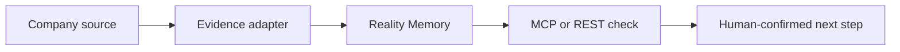

# Connect Company Brain

Company Brain is the evidence and memory checkpoint inside an existing workflow. It does not replace Slack, Drive, GitHub, an agent runtime, or an operator.



Open **Integration Studio** at `/app/connect`. It reads `GET /integration-catalog` and `GET /source-connections`, so its labels reflect server configuration rather than client-side copy.

## Source adapters

| Source | Endpoint / job | Required configuration | Boundary |
| --- | --- | --- | --- |
| Slack | `POST /integrations/slack/events` | Signing secret, team ID, channel IDs | Signed messages from one configured `#ops-incidents` channel only; persisted before acknowledgement; no Slack write. |
| Google Drive | `POST /integrations/google-drive/sync` or worker poll | Read-only service account JSON/file, shared folder ID | Reads Google Docs, text, and PDFs in one shared folder; no write or sharing change. |
| GitHub | `POST /integrations/github/pr` | Webhook secret, token, repository allowlist | Signed, merged PRs from allowlisted repositories. |
| Verified Web | `POST /integrations/web/fetch` | Exact HTTPS host allowlist | API-key protected explicit fetch with SSRF, redirect, MIME, timeout, and size controls. Not web search. |

Source events are organization-scoped immutable ledger records. Each has a source/external ID, URL where available, raw payload hash, excerpt, source and retrieval time, freshness, availability, ACL scope, and lifecycle stage.

## Connect a workflow with REST

An existing workflow can submit normalized evidence and live context to a code-owned template. It receives a `DecisionBrief`; it does not receive authority to execute a company action.

```bash
NOW=$(date -u +%Y-%m-%dT%H:%M:%SZ)
curl -X POST https://brain.veriflowai.me/workflow-runs \
  -H 'Content-Type: application/json' \
  -H 'X-Brain-Api-Key: cb_live_...' \
  -d "{
    \"template_id\": \"release-safety\",
    \"evidence\": [{
      \"source_type\": \"github_pull_request\",
      \"source_name\": \"GitHub\",
      \"external_id\": \"acme/service#42\",
      \"occurred_at\": \"$NOW\",
      \"excerpt\": \"Merged PR changes the export-worker memory limit.\"
    }],
    \"live_context\": {
      \"worker_memory_mb\": 8,
      \"runbook_validated\": false,
      \"deployment_window_open\": true
    }
  }"
```

The browser judge sandbox uses the exact same contract, but its source records and memory expire after one hour.

## Connect an agent with MCP

Use authenticated Streamable HTTP:

```text
https://brain.veriflowai.me/mcp/
X-Brain-Api-Key: cb_live_...
```

The server resolves the organization from the API key. It ignores caller-supplied organization IDs.

| Permission | Tool | Purpose |
| --- | --- | --- |
| `mcp:read` | `recall_skills` | Recall established governed skills. |
| `mcp:read` | `inspect_memory` | Inspect active or superseded Reality Memory. |
| `mcp:read` | `query_evidence` | Inspect immutable evidence summaries and provenance. |
| `mcp:check` | `check_intercept` | Run a pre-flight memory/SAG check. |
| `mcp:workflow` | `evaluate_workflow` | Return the source-aware `DecisionBrief`. |
| `mcp:write` | `compile_experience` | Compile a deliberate resolved experience into durable skill memory. |

`/mcp/sse` is retired in production. MCP cannot record a human outcome or run a deployment, refund, feature-flag change, or Slack post.

## Status language

- `connected`: server configuration is complete.
- `setup_required`: the provider has not been configured on the server.
- `contract_ready`: a supported API contract is available.
- `fixture`: deterministic demo evidence only.
- `preview`: not production-ready.

OAuth 2.1 dynamic client registration, per-company secret-vault onboarding, and self-serve GitHub/Slack/Drive installation are roadmap items. They are not claimed by this submission.
