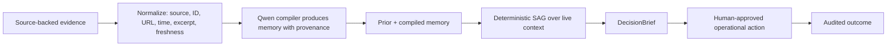

# Company Brain — Operational Memory for Safe Company Actions

**Track:** MemoryAgent · Qwen Cloud Global AI Hackathon 2026
**One line:** Company Brain turns changing operational evidence into governed memory, checks it against live context, and routes a safe next step to a human owner.

**Judge route:** `/` after deployment.
**Deployment evidence:** [`docs/DEPLOYMENT_PROOF.md`](docs/DEPLOYMENT_PROOF.md) is intentionally pending until a verified Alibaba Cloud ECS/SAS deployment is captured.

## The problem

Teams already have the evidence they need to avoid bad actions: a merged PR, a support-policy exception, or an error spike. The failure is that the evidence lives in separate systems while agents act from an older memory.

That creates a familiar operational mistake:

> “This used to be safe” becomes “do it automatically,” even though live reality changed.

Company Brain makes that break visible before an action happens.

## What judges see first

The four-module Launchpad gives judges one guided workflow sandbox plus three reusable workflow simulations, not four disconnected agents:

| Template | Evidence that changes the answer | Safe result |
| --- | --- | --- |
| Release Safety | A GitHub PR and runtime evidence lower the worker-memory limit below the runbook assumption. | Suspend the release; assign an engineering owner. |
| Money Safety | A support request conflicts with an enterprise contract or refund policy. | Pause the automatic refund; assign support operations. |
| Rollout Safety | Current error rate and an open incident invalidate a feature-flag expansion. | Hold expansion; assign the rollout owner. |

Every simulation is server-evaluated and exposes the same `DecisionBrief`:

`facts · Qwen inference · missing evidence · source excerpts/freshness · prior memory · SAG trace · verdict · owner · recommended next action`

## How it works



`WorkflowTemplate`s are code-owned and versioned for this submission. Each declares source requirements, required evidence fields, live-context schema, deterministic SAG rule, memory type, owner role, action recommendation, fixture, and evaluation cases. This is deliberately not a no-code builder.

The stable API surface is:

```text
GET  /workflow-templates
GET  /demo/modules
POST /demo/session
POST /workflow-runs
GET  /workflow-runs/{id}
POST /workflow-runs/{id}/outcome
GET  /workflow-sources
GET  /demo/readiness
```

## Why this is real rather than a scripted verdict

- The UI renders backend-returned verdicts only. If the backend is unavailable, it says so; it does not manufacture a green/red outcome.
- `POST /workflow-runs` normalizes the supplied evidence, computes freshness and missing fields, runs Qwen compilation where configured, and evaluates the template's deterministic SAG predicate.
- Release Safety implements a real signed GitHub merged-PR webhook when its secret, token, and repository allowlist are configured. The webhook persists raw evidence, compiled skill, audit record, SSE propagation, and a linked `release-safety` workflow run before returning success. A PR with no runtime telemetry honestly returns `review_required`.
- Money Safety and Rollout Safety use the identical contract as visibly labelled canonical demo fixtures, not claimed live connectors.
- The `/app/connect` page and server-defined `GET /integration-catalog` distinguish a configured source, a stable REST contract, a fixture, and a preview rather than implying a connector marketplace.
- `judge-demo-v1` is immutable. The public playground receives an opaque, browser-scoped temporary sandbox; fixture replays never add a canonical skill or confidence increment.
- A skill can only gain confidence or become `auto_execute`-eligible after a persisted **human-confirmed** outcome. All workflow actions remain human-approved.

## Under-three-minute video script

1. Open `/`. In one glance, show the guided workflow sandbox and the three real-world simulations.
2. Open **Release Safety** and click **Simulate decision**. Show the four live stages: evidence, Qwen memory, SAG, and human action. Expand Audit proof for the GitHub PR, runtime evidence, remembered 25 MiB rule, changed value of 8 MiB, and deterministic SAG trace.
3. Record a sandbox-only human outcome, then open **Money Safety** and **Rollout Safety** to prove the same evidence-to-memory-to-live-context contract generalizes.
4. Open **Brain** only as technical proof: the underlying SAG trace, skill/audit history, and Qwen-backed memory layer are still available.
5. Show `/api/demo/readiness` on the deployed host: build SHA, Qwen configuration, scenario version, and canonical counts. Then show the redacted Alibaba Workbench Overview screenshot.

Suggested narration: *“Company Brain does not merely retrieve a lesson. It proves whether that lesson still applies, names the accountable owner, and preserves the outcome without silently training itself from a demo click.”*

## Qwen use

- `qwen-plus` compiles normalized operational evidence into structured, versioned memory.
- `text-embedding-v3` supports the existing recall layer.
- The Semantic Applicability Gate is intentionally deterministic after the model step, so an operator can inspect exactly why a recommendation was suspended or requires review.

## Governance and scope boundaries

- External actions are recommendations only; the product does not execute refunds, deploys, or flag changes.
- Missing, stale, unavailable, or unsupported evidence returns `review_required`; no answer is invented.
- API-key permission strings are recorded as metadata in this hackathon build, not a complete RBAC authorization system.
- TDX hardware quotes are available only on an eligible Alibaba Confidential VM. On other hosts, the UI/API must present the RSA-PSS audit fallback, not claim hardware attestation.
- Operational counters are observed counts. The token-savings field is explicitly an estimate, not measured cost savings.

## Deployment proof

The repository contains the Docker/ECS deployment path and a runtime build-SHA readiness endpoint. The official rules require a repository code-file link that demonstrates Alibaba Cloud services/APIs; the deployment packet names those files and adds supplemental Workbench/runtime captures. Actual Alibaba deployment, public URL, and video publication are external submission steps and must only be marked complete after evidence is attached in [`docs/DEPLOYMENT_PROOF.md`](docs/DEPLOYMENT_PROOF.md).

## Links

| Asset | Path |
| --- | --- |
| Judge-facing workflow UI | `/` |
| Architecture | [`docs/ARCHITECTURE.md`](docs/ARCHITECTURE.md) |
| Deployment proof packet | [`docs/DEPLOYMENT_PROOF.md`](docs/DEPLOYMENT_PROOF.md) |
| Submission checklist | [`docs/SUBMISSION_CHECKLIST.md`](docs/SUBMISSION_CHECKLIST.md) |
| Source code | `backend/workflows/`, `backend/routers/workflows.py`, `frontend/src/pages/Simulation.tsx` |
