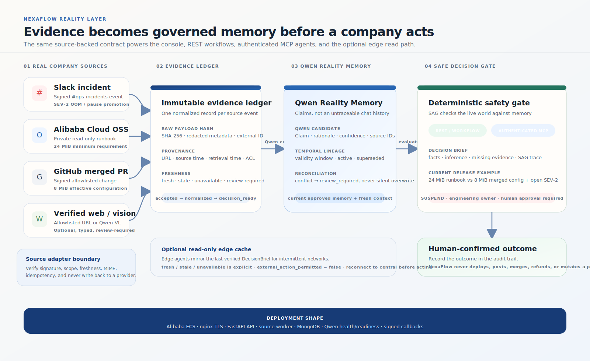

# NexaFlow: Reality Memory Before a Company Acts

**Qwen Cloud Hackathon 2026 | MemoryAgent track**

## One-line pitch

NexaFlow prevents an automated release from acting on stale company reality by
turning a signed Slack incident, an approved Alibaba Cloud OSS runbook, and a
merged GitHub change into source-backed Qwen memory and a human-required
release decision.

## The problem

Operational truth is fragmented across the systems where work already happens:

- an incident is reported in Slack;
- the approved safety requirement lives in a runbook;
- the runtime change is merged in GitHub;
- the release workflow sees only the latest configuration.

An agent can therefore be locally correct and globally unsafe. It may know that
a release was previously safe while missing a new incident or a policy change.
The result is not an ordinary search problem. It is a memory and decision
problem: which claim is current, what evidence supports it, what changed, and
who must confirm the next action?

## The NexaFlow solution

NexaFlow is the operational memory checkpoint that sits between company sources
and an agent or consequential workflow. It does not replace Slack, OSS, GitHub,
an agent, or a deployment system. It makes the decision boundary explicit:

~~~text
real source event
    -> immutable normalized evidence
    -> Qwen Reality Memory with provenance
    -> deterministic SAG safety check
    -> DecisionBrief for a human owner
    -> human-confirmed outcome
~~~

The primary demo is a NexaFlow fulfillment release:

1. Slack #ops-incidents receives:

   SEV-2: fulfillment workers are OOM. Pause promotion for the release until the incident is resolved.

2. Alibaba Cloud OSS contains the current read-only runbook:

   Fulfillment workers require at least 24 MiB of memory before release promotion.

3. A signed, merged GitHub pull request changes:

   NEXAFLOW_FULFILLMENT_WORKER_MEMORY_MB=32
   to
   NEXAFLOW_FULFILLMENT_WORKER_MEMORY_MB=8

4. The console runs the aggregate release check.
5. The returned decision is **suspended**:

   8 MiB < 24 MiB and the incident is open.

6. NexaFlow names the engineering release owner and recommends the safe next
   action. It does not deploy, change GitHub, write to OSS, post to Slack, or
   close the incident.

## Why this is a MemoryAgent

NexaFlow is not a chat wrapper around three APIs. It builds a persistent,
auditable memory layer:

- **Claims:** Qwen turns normalized evidence into operational claims and
  rationale.
- **Provenance:** every claim links to source ingestion IDs, source timestamps,
  retrieval time, content hash, freshness, availability, and ACL scope.
- **Validity:** claims carry a validity window and deterministic status.
- **Supersession:** a newer or conflicting runbook does not silently overwrite
  an older claim. The older claim remains auditable and is marked superseded or
  review-required.
- **Decision use:** the safety gate evaluates only current approved memory and
  fresh live context.

Qwen is used where interpretation is valuable: evidence-to-memory compilation,
structured rationale, and semantic recall through qwen-plus and
text-embedding-v3. The final safety verdict is deterministic so the same
evidence produces an explainable, reproducible result. If Qwen is unavailable,
the system exposes that state; it never claims that a memory was compiled.

## Architecture

~~~mermaid
flowchart LR
  S["Slack #ops-incidents"] --> L["Immutable evidence ledger"]
  O["Alibaba Cloud OSS runbook"] --> L
  G["GitHub merged PR"] --> L
  W["Verified web adapter"] --> L
  L --> Q["Qwen Reality Memory\nclaims + provenance + freshness"]
  Q --> R["REST / authenticated MCP\nDecisionBrief gateway"]
  R --> A["Deterministic SAG\ncurrent memory + live context"]
  A --> H["Human release owner\nconfirmation required"]
  H --> Q
~~~

### Evidence layer

Source adapters accept only their configured boundaries:

- Slack verifies the signing secret, replay window, team, and
  #ops-incidents channel.
- Alibaba OSS reads one private bucket/prefix using read-only RAM credentials.
- GitHub verifies the webhook signature, repository allowlist, merged-PR state,
  and read-only diff fetch.
- Verified web, when enabled, is an authenticated HTTPS allowlist with
  redirect, private-IP/SSRF, MIME, timeout, and size controls. It is not a
  generic search proxy.

Each accepted event is idempotent and moves through:

accepted -> fetched -> normalized -> qwen_compiled -> reconciled -> decision_ready

Failures retain their stage and reason. The source worker processes durable
pending records, so a provider acknowledgment is not confused with successful
memory compilation.

### Reality Memory layer

The ledger stores normalized evidence rather than optimistic client state:

source ID | external ID | URL | excerpt | raw-payload SHA-256 | source time | retrieval time | freshness | availability | ACL scope

Qwen produces a memory candidate with subject, predicate, scope, rationale, and
linked evidence. Reconciliation makes temporal state visible. An old claim is
never silently replaced.

### Governed action layer

The shared REST and MCP contracts return an auditable DecisionBrief:

facts | inference | missing evidence | source excerpts/freshness | prior memory | SAG trace | verdict | owner | recommended next action

MCP is an agent connection, not an executor. Its read and workflow tools can
inspect memory, query evidence, and evaluate a workflow. No MCP tool can deploy,
refund, change a feature flag, modify GitHub or OSS, or post to Slack.

### Human layer

Every consequential recommendation ends at a named owner and a confirmation
boundary. The UI can record a sandbox outcome for rehearsal; it cannot execute
the external company action. Human confirmation is also the gate for any
future reinforcement or auto-execution eligibility.

### Cross-agent memory handoff

The same authenticated MCP boundary can support more than one agent without
turning the brain into an executor. A sales or incident agent can call
write_operational_note with a subject, claim, and references to already
ingested evidence. A customer-success or release agent can call
query_cross_agent_memory and receive the same note, Reality Memory ID, source
excerpts, freshness, and agent provenance. Notes are idempotent, organization
scoped, and explicitly marked as agent-authored rather than Qwen-generated.
Both tools preserve the human approval and no-external-action flags.

### Multimodal and edge extension

An authenticated agent can submit a redacted dashboard screenshot to the
vision evidence adapter. Qwen-VL returns a typed observation (metric, unit,
confidence, and review flag); NexaFlow stores the SHA-256 digest and the
observation, never the original image. If the vision model is unavailable, the
ledger says `qwen_status=unavailable`, emits no metric, and requires review.

For warehouses with intermittent connectivity, the optional edge profile keeps
the latest server-issued memory and decision in a small read-only cache. It
does not claim local inference or permit external execution; a failed sync is
visible as `stale` or `unavailable`.

## What a judge can see

The root route is the **NexaFlow Live Operations Console**. It is intentionally
minimal:

1. three backend-derived source tiles for Slack, Alibaba OSS, and GitHub;
2. one primary action: **Run release safety check**;
3. the returned verdict, blocker, owner, and action;
4. persisted evidence and Reality Memory lineage;
5. a **Qwen case proof** action that runs five private realities through the
   same compiler and SAG engine;
6. a collapsed **Audit proof** section containing the server response,
   provenance, parsing values, and deterministic SAG trace.

After a run, the console shows the exact facts:

~~~text
Runbook minimum: 24 MiB
Merged configuration: 8 MiB
Slack incident: Open
Verdict: Suspended
Owner: NexaFlow engineering release owner
Execution: Human confirmation required
~~~

The result is a real backend response, not a fixture-only UI animation. The
case proof covers a memory regression, a safe resolved incident, an open
incident with safe memory, missing policy, and stale policy. Each case invokes
Qwen compilation, exposes the returned model/status, then shows the
deterministic verdict. The cases are ephemeral and cannot change canonical
memory or external systems. The browser supplies no organization ID, source
evidence, provider credentials, or verdict.

## Real integrations

### Slack

The signed Events API endpoint accepts only the configured NexaFlow workspace
and #ops-incidents. Events are verified, persisted, and then processed by the
worker. NexaFlow never sends messages or reads outside the allowlisted channel.

### Alibaba Cloud OSS

The runbook is stored in a private Alibaba OSS bucket. A least-privilege RAM
identity can list the configured prefix and read the runbook object, but cannot
put, delete, or modify objects. A manual sync and background polling share the
same evidence ledger.

### GitHub

The GitHub webhook accepts only signed pull_request events for the configured
repository and only after the pull request is merged. A read-only token fetches
the diff. The raw event, merged configuration, Qwen compilation, audit record,
and normalized evidence are persisted before the event is decision-ready.

## Deterministic safety rule

The release template evaluates:

~~~text
configured_memory_meets_runbook == true
AND
linked_incident_open == false
~~~

The demo therefore suspends on either independent failure:

- the merged worker memory is below the current OSS runbook minimum; or
- a fresh Slack incident remains open.

If any required source is missing, stale, unavailable, unsigned, out of scope,
or not safely parseable, the result is review_required. NexaFlow never
converts missing evidence into a safe or suspended verdict.

## Demo script (2 minutes 30 seconds)

### 0:00-0:10 - State the problem

Open the console and say:

> The release workflow has a new GitHub configuration, but operational truth is
> spread across Slack and the runbook. NexaFlow checks the company memory before
> anyone acts.

### 0:10-0:30 - Show the three sources

Point to the server-derived source cards and the persisted evidence timeline:

- Slack incident: OOM and pause promotion;
- OSS policy: 24 MiB minimum;
- GitHub merged PR: 8 MiB.

### 0:30-0:50 - Run the decision

Click **Run release safety check**. The console returns:

> Suspend the release, restore or re-approve the worker memory setting, and
> have the engineering release owner resolve the cited incident.

Point out the 24 MiB versus 8 MiB comparison and the open incident.

### 0:50-1:10 - Prove memory and Qwen

Open Reality Memory and Audit proof. Show the source IDs, freshness, Qwen
status/rationale, memory lineage, and SAG trace. Explain that Qwen compiles
source records while the final gate is deterministic and auditable.

### 1:10-1:25 - Prove the safety boundary

Show Human confirmation required and:

> The recommendation is real, but no deployment, Slack post, GitHub change, or
> OSS write was executed.

### 1:25-1:45 - Prove the agent boundary

Show the authenticated Streamable HTTP MCP contract. One agent writes an
evidence-linked Acme blocker note; a second agent queries the same provenance.
Both agents can read the DecisionBrief, but neither can execute the release.

### 1:45-2:05 - Optional multimodal proof

Submit a dashboard screenshot through the authenticated Qwen-VL adapter. Show
the typed observation, image SHA-256, confidence, and review flag. If Qwen-VL
is unavailable, show the explicit unavailable state; do not substitute a
guessed metric.

### 2:05-2:20 - Optional edge proof

Show the edge cache returning the latest server-issued memory as `fresh` (or
`stale` when disconnected), with `human_approval_required=true` and
`external_action_permitted=false`.

### 2:20-2:30 - Deployment proof

Show the deployed build SHA, Qwen health, public HTTPS console, and an
authenticated MCP request. The public ECS runtime is already verified at
`https://brain.veriflowai.me/`; local Docker is not presented as cloud proof.
The only remaining manual submission artifacts are a redacted Alibaba
Workbench Overview screenshot with the instance running and the short demo
video.

## Local rehearsal

The repository supports a local-first Docker Compose rehearsal with MongoDB,
FastAPI, a durable source worker, and nginx:

~~~powershell
powershell -ExecutionPolicy Bypass -File scripts/start-local.ps1
~~~

Then open http://localhost/. Configure the three read-only source adapters at
http://localhost/setup, send the Slack incident, sync the OSS runbook, merge the
GitHub PR, run the release check, and use **Run Qwen case proof** to rehearse
the five alternate realities.

No provider secret is committed or exposed in the browser. The local rehearsal
uses a dedicated companybrain_nexaflow database and does not reuse the previous
demo volume.

## Verification evidence

The verified local gate includes:

- signed Slack intake and replay/idempotency handling;
- signed merged GitHub intake and webhook recovery;
- read-only OSS sync and source hashing;
- freshness and missing-evidence handling;
- temporal memory supersession;
- source-org isolation and no caller-controlled organization;
- MCP scope and cross-organization checks;
- no-external-action enforcement;
- backend tests: 95 passed, 5 intentionally skipped without Mongo integration;
- Mongo integration tests: 5 passed;
- Qwen case matrix: 5 ephemeral compilations, with suspended,
  proceed-with-human-approval, and review-required outcomes;
- production frontend build: passed;
- clean Docker API, worker, MongoDB, and nginx boot;
- edge profile smoke: `fresh` snapshot, stale fallback, and no-action boundary;
- browser-facing local release-check request: HTTP 200, verdict suspended;
- public ECS health/readiness: HTTP 200, Qwen configured, embeddings healthy,
  scenario `nexaflow-live-v1`, and 3 evidence / 3 memories / 19 workflow runs;
- public browser rehearsal: connected Slack, Alibaba OSS, and GitHub tiles,
  suspended release decision, named owner, human-confirmation boundary, and
  expandable audit proof;
- authenticated Streamable HTTP MCP: initialize, `tools/list` (8 tools),
  `query_evidence`, and `check_intercept`; the response confirmed
  `external_action_permitted=false`, `human_approval_required=true`, and
  `auto_execute=false`.

## Deployment proof

The code includes the Alibaba ECS Docker/TLS deployment path, nginx
configuration, certificate renewal services, readiness/build metadata, and
authenticated MCP forwarding. The current public deployment is verified at
`https://brain.veriflowai.me/` on build
`89c2735baa26129ecc833316457b87bd6a20e16f`:

- runtime health/readiness reports MongoDB `companybrain_nexaflow` connected,
  Qwen configured, embeddings healthy, and the canonical NexaFlow counts;
- the public HTTPS console returns the real suspended release decision from
  the three persisted source records;
- authenticated MCP and integration-catalog behavior were exercised against
  the deployed endpoint, including the no-external-action boundary;
- the legacy public `/mcp/sse` route returns `410`.

The local acceptance run is not presented as cloud deployment proof. Before
submission, capture the redacted Alibaba Workbench Overview with the instance
in `Running` state and record the 1–3 minute demo video. Do not expose account
identifiers, IP addresses, API keys, or provider secrets.

See docs/DEPLOYMENT_PROOF.md for the exact capture manifest.

## Why this is technically non-trivial

- Multiple signed/read-only source boundaries converge on one immutable ledger.
- Evidence is normalized before model compilation, so provenance survives the
  Qwen step.
- Temporal reconciliation preserves old claims and makes supersession explicit.
- Qwen interpretation is combined with deterministic safety predicates instead
  of allowing a model to silently approve an action.
- The same DecisionBrief is available to the UI, REST, and authenticated MCP.
- Durable workers, idempotency, freshness, scoped credentials, and human
  outcomes are part of the product contract rather than demo decorations.
- The browser is deliberately untrusted: it cannot choose an organization,
  inject evidence, or claim a verdict.

## Scope and honest boundaries

NexaFlow is production-shaped for this submission, but it does not claim:

- a generic connector marketplace;
- self-service OAuth onboarding for every company;
- broad enterprise RBAC or secret-vault provisioning;
- arbitrary no-code workflow construction;
- autonomous deployment, refunds, feature-flag changes, or Slack posting;
- guaranteed Qwen availability when the configured service is unavailable;
- guaranteed competition placement.

OAuth 2.1, per-company onboarding, expanded providers, and external action
adapters are the next product layer after the hackathon.

## Judging alignment

| Criterion | Evidence in NexaFlow |
| --- | --- |
| Innovation and AI creativity | Qwen Reality Memory makes source-backed operational claims temporal, attributable, and supersedable instead of treating memory as a flat chat history. |
| Technical depth and engineering | Signed adapters, durable ingestion, Mongo persistence, Qwen compilation, embeddings, temporal reconciliation, deterministic SAG, scoped MCP, Docker worker architecture, and tests. |
| Problem value and impact | Prevents a concrete class of unsafe releases caused by an open incident or policy/configuration mismatch. |
| Presentation and documentation | One primary console, one memorable end-to-end story, visible evidence-to-decision trace, audit proof, architecture, local setup, and deployment capture plan. |

## Submission links

- Repository: https://github.com/BoBbY-dev-0099/company-brain
- Judge route (verified): https://brain.veriflowai.me/
- Verified build: `89c2735baa26129ecc833316457b87bd6a20e16f`
- Architecture: [docs/ARCHITECTURE.md](docs/ARCHITECTURE.md) · [standalone SVG](docs/nexaflow-reality-architecture.svg)
- Setup guide: CONNECT.md
- Deployment proof: docs/DEPLOYMENT_PROOF.md
- Submission checklist: docs/SUBMISSION_CHECKLIST.md
- Release policy fixture: real-workflow/runbooks/fulfillment-release-policy.md
