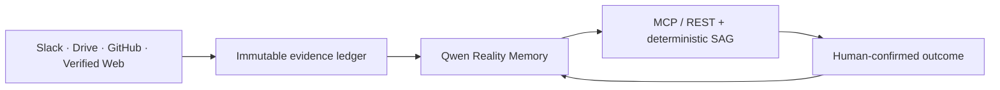

# Company Brain — Reality Memory for Safe Company Actions

**Track:** MemoryAgent · Qwen Cloud Global AI Hackathon 2026

**Live judge route:** `https://brain.veriflowai.me/`

## The problem

Company decisions are often made by agents or automation after reality has changed. A production incident is in Slack, a requirement is in Drive, and the changed configuration is in GitHub. The decision system still remembers an older safe condition and acts with confidence.

Company Brain turns those sources into an evidence-backed, time-aware company memory before a consequential action is recommended.

## What judges can run

The root route is a **Company Reality Console**. It shows four source tiles, one current-risk statement, and one action: **Run incident-to-release check**.

That run uses the real private sandbox pipeline:

1. A Slack incident reports export-worker OOM failures.
2. A Drive runbook states the minimum safe memory condition.
3. A GitHub merged PR shows the value was changed from 25 MiB to 8 MiB.
4. Qwen compiles source-backed Reality Memory with provenance.
5. Deterministic SAG checks the live runtime value and suspends the release.
6. The `DecisionBrief` names the SRE/release owner and recommended next action.

The console then exposes the actual backend response: source excerpt and hash, source/retrieval time, freshness, Qwen status and rationale, memory lineage, SAG trace, MCP request/result, and human outcome boundary. It never invents a favorable verdict in the browser.

Money Safety and Rollout Safety are compact reuse proofs of the same template engine. `/play/workflow` is a chat-like temporary lab: a judge describes a release, refund, or rollout condition; the browser receives a private MCP key and calls the same `evaluate_workflow` tool without submitting company credentials.

## Four layers, one governed flow

- **Evidence layer:** source-specific adapters produce immutable normalized records with source ID, URL, SHA-256 payload hash, excerpt, timestamps, freshness, availability, ACL scope, and state.
- **Reality Memory layer:** Qwen creates claims with source provenance and validity. Contradictory evidence creates an explicit supersession link; it never silently overwrites a claim.
- **Governance gateway:** MCP and REST return a common `DecisionBrief`. SAG evaluates current evidence and live context deterministically.
- **Human layer:** recommendations have owners; no company action is callable from MCP. Sandbox outcomes expire and cannot reinforce durable memory.

## Qwen use

`qwen-plus` compiles normalized operational evidence into memory candidates and explanations. `text-embedding-v3` supports semantic recall of the established skills. The safety verdict remains deterministic after the model step so it is auditable and reproducible.

## Integration reality

Slack is a signed Events API intake restricted to one configured workspace and `#ops-incidents`. Google Drive is a read-only service account restricted to one explicitly shared folder. GitHub remains a signed, repository-allowlisted merged-PR intake. Verified web evidence is an authenticated, exact-host HTTPS fetcher with SSRF, redirect, MIME, timeout, and size controls.

The interface labels these connections from server configuration: `connected`, `setup_required`, `contract_ready`, `fixture`, or `preview`. It does not claim a connected Slack or Drive source until their server variables are actually configured.

The remote MCP endpoint is authenticated Streamable HTTP at `/mcp/`. API-key scopes allow memory reading, safety checking, workflow evaluation, or explicitly permitted compilation. Organization identity always comes from the key—not caller input.

## Safety boundaries

- No deploy, refund, feature-flag, Slack post, or external company action is executable through Company Brain.
- Browser clients cannot submit source credentials or organization IDs.
- Public demos are private, expiring sandbox data; canonical evidence and skill confidence are isolated.
- OAuth 2.1, per-company secret vaults, full RBAC, and a connector marketplace are documented next steps, not shipped claims.
- TDX is only reported when the current Alibaba host actually verifies it; otherwise the API reports its RSA audit fallback.

## Demo script (under three minutes)

1. Open the Reality Console and identify the current release risk.
2. Run the incident-to-release check; narrate each source and inspect its memory record.
3. Show the deterministic SAG mismatch and the human owner in the returned MCP `DecisionBrief`.
4. Open the Live Workflow Lab and show the same MCP contract.
5. Click Money Safety and Rollout Safety to show one reusable engine.
6. Show `/api/demo/readiness` and the redacted Alibaba deployment proof.

## Submission material

- [Architecture](docs/ARCHITECTURE.md)
- [Connection guide](CONNECT.md)
- [Deployment proof](docs/DEPLOYMENT_PROOF.md)
- [Pre-submit checklist](docs/SUBMISSION_CHECKLIST.md)
