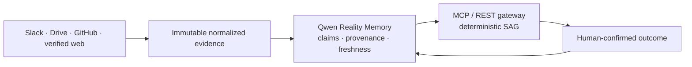

# Company Brain

Source-backed Reality Memory for consequential company decisions, built for the Qwen Cloud Global AI Hackathon.

> Company Brain does not replace a company’s agents or systems. It is the governed memory checkpoint they call before consequential actions.

Open the public judge route at `/`. It runs a complete incident-to-release trace:



The first fold shows the source posture, current risk, and a single **Run incident-to-release check** action. It proves the flow with a private, expiring sandbox; it never deploys, refunds, changes a flag, or posts to Slack.

## Judge walkthrough (90 seconds)

1. Open [the Reality Console](https://brain.veriflowai.me/). The four source tiles use backend-derived runtime labels, not optimistic client state.
2. Click **Run incident-to-release check**. The trace must advance in order: source evidence, Qwen Reality Memory, MCP decision gateway, then human owner.
3. Read the returned recommendation: the release is suspended because the incident, runbook, GitHub change, and runtime value no longer agree.
4. Inspect the evidence rows for observed/retrieved times, freshness, availability, ACL scope, payload hash, and Qwen status. Open **Audit proof** for complete server responses.
5. Open `/play/workflow` to show the same authenticated MCP contract in a temporary judge sandbox; use Money Safety and Rollout Safety as short reuse proof.

The live deployment is self-identifying: `GET /api/demo/readiness` reports its build SHA, Qwen health, scenario version, canonical counts, and sandbox-isolation status. Do not use a screenshot or README claim as a substitute for that response.

## What is shipped

| Layer | What it does | Truthful boundary |
| --- | --- | --- |
| Evidence adapters | Accepts signed Slack messages, reads a restricted Drive folder, records signed GitHub merged-PR intake, and fetches explicit allowlisted HTTPS URLs. | No browser credentials, no generic connector marketplace, no broad web search. |
| Reality Memory | Keeps Qwen-compiled claims with source links, retrieval time, freshness, availability, ACL scope, and explicit supersession. | A missing Qwen key is shown as `unavailable`; no model result is fabricated. |
| Decision gateway | Returns a common `DecisionBrief` through REST or authenticated Streamable HTTP MCP. Deterministic SAG evaluates fresh evidence and live context. | MCP has no tool for external execution. |
| Human outcome | Records the accountable owner’s sandbox outcome and keeps reinforcement gated behind a human-confirmed result. | Sandbox data expires and cannot alter canonical demo counts or another judge’s data. |

### Supported source states

`connected` means server configuration is complete; `setup_required` means it is not configured; `contract_ready` is a supported API contract; `fixture` is demo evidence; `preview` is not yet production-ready. The backend, not the frontend, supplies these labels at `GET /integration-catalog`.

The UI includes three compact reusable proof cases:

- **Release Safety** — a Slack incident, Drive runbook, GitHub change, and runtime metric suspend a release.
- **Money Safety** — contract or policy evidence stops an automatic refund.
- **Rollout Safety** — reliability evidence holds a feature expansion.

## Qwen’s role

`qwen-plus` compiles normalized source evidence into a memory candidate and rationale. `text-embedding-v3` supports existing semantic skill recall. The final safety verdict is intentionally deterministic: SAG evaluates required evidence, freshness, and live context after the model step, so a judge can inspect why the recommendation changed.

## MCP connection

The canonical endpoint is `https://brain.veriflowai.me/mcp/` when deployed. Every request requires `X-Brain-Api-Key`; the key resolves the organization, so callers cannot supply an organization ID.

| Scope | Tools |
| --- | --- |
| `mcp:read` | `recall_skills`, `inspect_memory`, `query_evidence` |
| `mcp:check` | `check_intercept` |
| `mcp:workflow` | `evaluate_workflow` |
| `mcp:write` | `compile_experience`, authenticated Drive sync, authenticated verified-web fetch |

`evaluate_workflow` returns the same source-aware `DecisionBrief` as `POST /workflow-runs`. It may recommend a human action; it cannot perform a company action. See [`real-workflow/`](real-workflow/) for a small remote-MCP client.

## Source configuration

All secrets stay in server environment variables. The public UI accepts neither credentials nor an organization ID.

| Provider | Required server configuration | Read boundary |
| --- | --- | --- |
| Slack | `SLACK_SIGNING_SECRET`, `SLACK_ALLOWED_TEAM_ID`, `SLACK_ALLOWED_CHANNEL_IDS` | Signed Events API input, exact team and `#ops-incidents` channel allowlist, five-minute replay window; never posts to Slack. |
| Google Drive | `GOOGLE_SERVICE_ACCOUNT_JSON` or `GOOGLE_SERVICE_ACCOUNT_FILE`, `GOOGLE_DRIVE_FOLDER_ID` | One explicitly shared folder; Google Docs, text, and PDFs only; never writes to Drive. |
| GitHub | `GITHUB_WEBHOOK_SECRET`, `GITHUB_TOKEN`, `GITHUB_REPOS` | Signed merged-PR intake and repository allowlist. |
| Verified Web | `WEB_EVIDENCE_ALLOWED_HOSTS` | API-key authenticated, HTTPS-only explicit fetch; blocks private IPs, unsafe redirects, unsupported MIME types, and oversize bodies. |

Copy [`.env.example`](.env.example) to `.env`; leave source values blank unless the server is genuinely configured. The Docker `worker` consumes durable source events and performs the optional Drive polling sync.

## Local run

```powershell
Copy-Item .env.example .env
# Set QWEN_API_KEY in .env if you want live Qwen compilation.
docker compose --profile full up --build -d
curl http://localhost/api/health
curl http://localhost/api/demo/readiness
```

For development without Docker, start MongoDB as a replica set, install `requirements.txt`, run `uvicorn backend.main:app --reload`, then run `npm.cmd install` and `npm.cmd run dev` in `frontend/`.

## Verification

```powershell
# Backend unit and contract coverage
python -m pytest backend/tests -q

# Production UI bundle
cd frontend
npm.cmd run build
```

The source test suite covers Slack HMAC/replay and channel restrictions, Drive content-version ingestion, verified-web SSRF rejection, sandbox expiry, temporal memory boundaries, workflow safety, and MCP scopes. The public rehearsal must also confirm that the visual trace renders the server response after every stage; it must never fabricate a verdict or Qwen completion in the browser.

## Useful endpoints

| Method | Path | Purpose |
| --- | --- | --- |
| `GET` | `/demo/readiness` | Build SHA, Qwen health, scenario version, and canonical counts. |
| `GET` | `/source-connections` | Server-derived source health and allowed scope. |
| `GET` | `/source-events` | Immutable normalized evidence for the scoped organization. |
| `GET` | `/reality-memory` | Active and superseded source-backed memory. |
| `POST` | `/integrations/slack/events` | Signed Slack event intake. |
| `POST` | `/integrations/google-drive/sync` | Scoped, API-key authenticated Drive sync. |
| `POST` | `/integrations/web/fetch` | Scoped, API-key authenticated verified URL fetch. |
| `POST` | `/workflow-runs` | Evaluate an evidence/live-context workflow. |
| `POST` | `/workflow-runs/{id}/outcome` | Record a human-confirmed outcome. |
| `GET` | `/integration-catalog` | Truthful integration capability catalog. |
| `POST` | `/mcp/` | Authenticated Streamable HTTP MCP transport. |

## Submission material

- [Architecture](docs/ARCHITECTURE.md)
- [Connection guide](CONNECT.md)
- [Hackathon write-up](HACKATHON_WRITEUP.md)
- [Deployment proof checklist](docs/DEPLOYMENT_PROOF.md)
- [Pre-submit checklist](docs/SUBMISSION_CHECKLIST.md)
- [MIT License](LICENSE)

## Scope and safety

This is a production-shaped hackathon build, not a claim of self-serve OAuth onboarding, a connector marketplace, general enterprise RBAC, autonomous execution, or verified hardware attestation on every host. OAuth 2.1 and per-company secret-vault onboarding are documented next steps. Hardware attestation is reported only when the running host verifies it; otherwise decisions retain the explicit RSA audit fallback.
