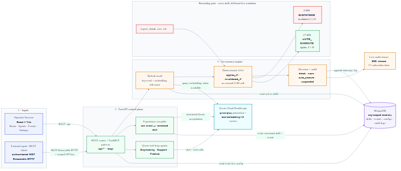
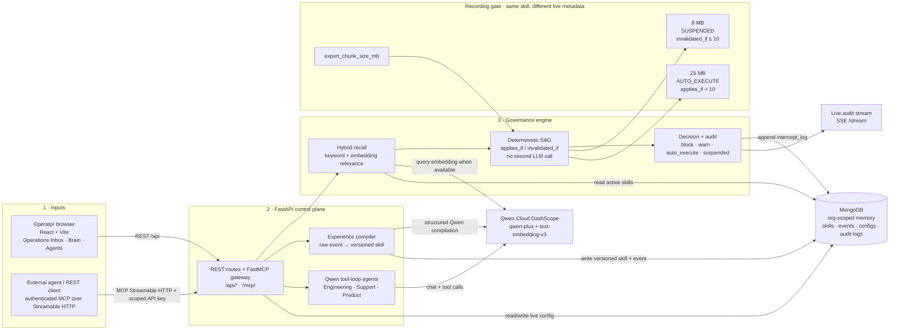

# Company Brain

[](LICENSE)
[](HACKATHON_WRITEUP.md)

Operating Memory Primitive for agent fleets — Qwen Cloud Global AI Hackathon 2026 (MemoryAgent track).

> **Most agents remember. Company Brain knows when to stop trusting what it remembers.**

**Judges / 30s demo:** open **Operations** (`/app/inbox`) and inspect one server-owned workflow card: evidence → Qwen memory → live context → SAG verdict → human owner.
The open UI writes to the disposable `sandbox` org; the versioned `judge-demo-v1` fixture is immutable.
**Writeup:** [`HACKATHON_WRITEUP.md`](HACKATHON_WRITEUP.md) · **Deployment evidence:** [`docs/DEPLOYMENT_PROOF.md`](docs/DEPLOYMENT_PROOF.md) · **License:** [MIT](LICENSE)

## Submission pack (for judges)

| Asset | Link |
| ----- | ---- |
| Written summary | [`HACKATHON_WRITEUP.md`](HACKATHON_WRITEUP.md) |
| Architecture (diagram + SAG sequence) | [`docs/ARCHITECTURE.md`](docs/ARCHITECTURE.md) |
| Architecture diagram (PNG) | [`docs/architecture.png`](docs/architecture.png) |
| Mermaid source | [`docs/ARCHITECTURE.mmd`](docs/ARCHITECTURE.mmd) |
| Judging alignment | [`docs/JUDGING_ALIGNMENT.md`](docs/JUDGING_ALIGNMENT.md) |
| Submission checklist | [`docs/SUBMISSION_CHECKLIST.md`](docs/SUBMISSION_CHECKLIST.md) |
| Deployment proof packet | [`docs/DEPLOYMENT_PROOF.md`](docs/DEPLOYMENT_PROOF.md) |
| Company connection contract | [`CONNECT.md`](CONNECT.md) |
| License | [`LICENSE`](LICENSE) (MIT) |
| Integrations examples | [`integrations/`](integrations/) |

## Architecture

Company Brain sits between agent fleets / the operator UI and Qwen Cloud: FastAPI compiles experience into skills, intercepts decisions with hybrid recall + the deterministic Semantic Applicability Gate (SAG), persists state in MongoDB, and streams updates over SSE.



<details>
<summary>Mermaid source (same diagram)</summary>



</details>

**SAG flip (demo):** same engineering export decision; live `export_chunk_size_mb` decides the outcome.

| Config | SAG result |
| ------ | ---------- |
| `8` MB | `suspended` (`invalidated_if <= 10`) |
| `25` MB | `auto_execute` (`applies_if > 10`) |

Full sequence diagram and component tables: [`docs/ARCHITECTURE.md`](docs/ARCHITECTURE.md).

## The problem

Agent fleets retrieve past lessons but do not verify whether those lessons
still hold against **live system state**. Stale memory auto-executes
confidently — wrong refund window, wrong export chunk size, wrong rollout %.

## How we tackle it

Company Brain is not a chatbot and not an agent platform. It is a
**memory-and-governance layer** that any AI agent plugs into via MCP or REST:

1. **Compile** experience → versioned skills (Qwen)
2. **Recall** under limited context (`top_k`)
3. **Intercept** before action (hybrid keyword + embedding)
4. **SAG** — deterministic `applies_if` / `invalidated_if` vs live `metadata`
5. **Record a human-confirmed outcome** before confidence can increase
6. **Propagate** via SSE to the operator UI

Three demo agents (support, engineering, product) remain technical proof. The
primary product route is the reusable Operational Risk Inbox; production
systems call the same APIs (see `integrations/`).

## Operational workflow engine

The inbox is driven by server-defined, versioned `WorkflowTemplate`s rather
than isolated demo agents. Every template declares required source evidence,
live-context fields, deterministic SAG predicates, memory type, accountable
owner, recommended action, fixture, and evaluation cases. Every run returns a
common `DecisionBrief` with facts, Qwen inference, missing evidence, cited
sources/freshness, memory provenance, SAG trace, verdict, owner, and next
action.

The three submission templates are **Release Safety**, **Money Safety**, and
**Rollout Safety**. Release Safety implements a signed GitHub merged-PR intake
when its webhook secret, token, and repository allowlist are configured. The
other two are visibly labelled fixtures replayed through the same contract.
See [`CONNECT.md`](CONNECT.md) for the real connection boundaries and
[`HACKATHON_WRITEUP.md`](HACKATHON_WRITEUP.md) for the demo flow.

## Who this is for

Teams already running multiple independent AI agents who want those
agents to share what they've learned — without building a shared
memory and governance layer from scratch. This is infrastructure,
not an application.

## Production-shaped workflows

External systems do not live inside the brain. Company Brain is the governed
memory checkpoint they call before consequential actions. The signed GitHub
merged-PR path is the only configured-source claim in this submission; the
other examples under [`integrations/`](integrations/) are explicitly labelled
adapter fixtures. The connection catalog at `GET /integration-catalog` (or
`/api/integration-catalog` behind nginx) reports the runtime truth.

```bash
# After backend is up and seeded (API key for the org):
export BRAIN_BASE_URL=http://127.0.0.1:8000
export BRAIN_API_KEY=cb_live_...
python integrations/python-client/connect_to_brain.py
```

Demo order: Engineering export flip → Support refund flip → Product rollout
flip → Intercepts → compile flash → TEE attestation tab.

## Semantic Applicability Gate (SAG)

SAG is a deterministic, no-LLM layer that checks whether a matched skill's
preconditions still hold in the current live context before it is allowed to
block or auto-execute a decision. Each skill can declare `applies_if` and
`invalidated_if` conditions against keys passed in the request metadata.
The interceptor evaluates these conditions after the relevance gate and before
reinforcement.

**Current scope:** SAG evaluates live context supplied via the `metadata`
field on `POST /decisions/check` and on the MCP `check_intercept` tool.
Pass config values, deploy flags, or other runtime state as metadata keys
so each skill's `applies_if` / `invalidated_if` preconditions are checked
before block, warn, or auto-execute. The engineering agent's pre-flight
check forwards request metadata into the same path.

### Skill selection when metadata is present

If the decision request includes live `metadata` keys, the interceptor
**prefers skills whose `applies_if` / `invalidated_if` bind those keys**
over higher text-only matches with empty SAG conditions. That keeps the
demo flip from being shadowed by compiled lookalike skills.

### Known limitations

- **Concurrency:** skill reinforcement now uses an atomic
  aggregation-pipeline update (`$inc` on a matched document), so
  concurrent intercepts on the same skill no longer drop increments.
  It still needs load testing at production scale.
- **Contradiction resolution:** when metadata does not bind SAG keys,
  the highest text/embedding score still wins. Full multi-skill
  arbitration remains an open research problem.
- **Data governance:** compiled skills currently store raw event
  content verbatim, with no PII redaction or sensitivity
  classification. Any production deployment would need this before
  handling real customer data.

### Honest scope boundary

- **Ingestion from fragmented sources:** Company Brain compiles
  events agents explicitly submit (`POST /events`, MCP
  `compile_experience`). It does not yet ingest from Slack, email,
  tickets, or code review threads automatically. Unified ingestion
  across fragmented sources is an industry-wide unsolved problem —
  Y Combinator's adjacent RFS on connective infrastructure describes
  the same gap; this build does not claim to have solved it.
- **Typed recommendation vs. literal execution:** SAG and intercept
  return structured guidance (`recommended_action`, `avoid_actions`).
  They do not emit literal code patches or tool calls on their own.
  As AE Studio's agent-memory work distinguishes, durable memory
  must eventually drive **code or tool calls, not prose** — that
  execution layer is out of scope for this submission.

SAG is proven across three departments with three independent
example data sources — Support (refund vs. purchase recency),
Product (rollout vs. traffic percentage), Engineering (export
behavior vs. chunk size) — via the seeded demo skills in
`backend/demo/seed_data.py`.

### Roadmap (explicitly not in this submission)

Outcome-based trust recalibration — a skill demoted from
`auto_execute` based on confirmed real-world outcomes, not just
precondition drift — is the natural next axis of self-correction.
Scoped out of this submission for time; SAG remains the shipped,
fully-verified differentiator.

### Security fix: org-scoped reinforcement and intercept logging

A prior implementation of `check_decision` called `store.reinforce_skill()`
and `store.log_intercept()` without passing the authenticated `org_id`. This
caused every reinforcement and every intercept log entry to be written against
the `default` org, regardless of which API key made the request — a real
multi-tenancy leak. The current code passes `org_id` through the entire
interceptor path, so skills, reinforcement counts, and intercept logs stay
scoped to the calling org. The hackathon UI is open (no login); agents still
authenticate with `X-Brain-Api-Key`.

## Stack

| Layer    | Choice                                                               |
| -------- | -------------------------------------------------------------------- |
| LLM      | Qwen 3 (`qwen-plus`) via DashScope international compatible-mode     |
| Embeddings | Qwen `text-embedding-v3` (1024-dim)                                |
| Database | MongoDB 7 single-node replica set (Motor async driver)               |
| Backend  | FastAPI + sse-starlette + FastMCP (authenticated Streamable HTTP at `/mcp/`) |
| Frontend | React 18 + Vite + Tailwind + Framer Motion                           |
| Cloud    | Alibaba Cloud ECS + nginx + systemd                                  |

## Three demo agents

- **Support agent** — recalls relevant skills, resolves a ticket, compiles the resolution back to the brain.
- **Engineering agent** — runs a brain pre-flight intercept *before* the LLM call. PRs that match an existing skill get blocked or warned.
- **Product agent** — bridges sessions: when the same user returns, the agent prepends a cross-session context line referencing prior intents and any skills compiled since.

## Quick start

```bash
# 1. Mongo (single-node replica set; required for change streams + TTL)
cd company-brain
docker compose up -d
docker compose exec mongodb mongosh --quiet --eval "rs.status().ok || rs.initiate({_id:'rs0', members:[{_id:0, host:'localhost:27017'}]})"

# 2. Backend
python -m venv .venv
.venv\Scripts\activate              # PowerShell:  .\.venv\Scripts\Activate.ps1
pip install -r requirements.txt
copy .env.example .env              # paste your DashScope key
uvicorn backend.main:app --reload --host 0.0.0.0 --port 8000

# 3. Frontend
cd frontend
npm install
npm run dev                          # http://localhost:5173
```

The first backend boot seeds 8 realistic skills + 3 demo sessions if the
brain is empty, and (if `QWEN_API_KEY` is set) backfills embeddings for
each seeded skill.

## Smoke test

Use header `X-Brain-Api-Key` for agent keys (not `Authorization: Bearer cb_live_…`).

```bash
# health (public)
curl localhost:8000/health

# bootstrap a local key for the default org (one-time)
python integrations/python-client/bootstrap_api_key.py

# production-shaped SAG workflows (W1–W5)
export BRAIN_BASE_URL=http://127.0.0.1:8000
export BRAIN_API_KEY=cb_live_...   # from bootstrap
python integrations/python-client/connect_to_brain.py

# follow the SSE stream while you exercise the UI (separate terminal)
curl -N "localhost:8000/stream?token=$BRAIN_API_KEY"
```

## Docker (local ECS-shaped validation)

Full stack (Mongo + API + nginx serving the built frontend):

```bash
# set QWEN_API_KEY in .env first
docker compose --profile full up --build -d
curl http://localhost/api/health
```

This mirrors the ECS layout (nginx → uvicorn + static UI), but it is not cloud
deployment proof. Use it as a validation gate before the Alibaba ECS/SAS proof
steps in [`docs/DEPLOYMENT_PROOF.md`](docs/DEPLOYMENT_PROOF.md).

## API

| Method | Path                          | Purpose                                                             |
| ------ | ----------------------------- | ------------------------------------------------------------------- |
| GET | `/health`                     | service + db status, skill count, qwen-configured flag              |
| GET | `/demo/readiness`             | build SHA, Qwen/embedding state, fixture policy, canonical counts   |
| GET | `/workflow-templates`         | versioned templates plus server-evaluated fixture previews           |
| POST | `/workflow-runs`             | normalize evidence, compile/reuse memory, evaluate live-context SAG |
| GET | `/workflow-runs/{id}`         | one auditable DecisionBrief and outcome history                      |
| POST | `/workflow-runs/{id}/outcome` | record a human outcome; gate any reinforcement                      |
| GET | `/workflow-sources`           | canonical fixture and sandbox source-backed evidence                 |
| GET | `/integration-catalog`        | server-derived connected/preview/fixture contract catalog            |
| POST   | `/events`                     | compile a raw event into a skill, persist, propagate                |
| GET    | `/brain/events`               | list recent compiled events (org-scoped)                            |
| POST   | `/decisions/check`            | hybrid keyword + cosine intercept check + SAG                       |
| GET    | `/brain/skills`               | list active skills (filter by `?domain=`)                           |
| GET    | `/brain/skills/{skill_id}`    | full skill detail                                                   |
| GET    | `/brain/intercepts`           | intercept audit log                                                 |
| GET    | `/settings/metrics`           | governance hits, est. tokens saved, intercept breakdown             |
| GET/POST | `/settings/live-config`     | read/update org live metadata (SAG flip: `export_chunk_size_mb`)    |
| POST   | `/settings/seed-demo-data`    | idempotent org-scoped seed of the demo skill set (open UI or API key) |
| POST   | `/agents/{kind}/run`          | run support / engineering / product agent (Chat Completions + MCP)  |
| GET    | `/sessions/{user_id}`         | sessions for a user (cross-session demo)                            |
| GET    | `/sessions/by-id/{id}`        | one session                                                         |
| GET    | `/stream`                     | SSE event stream (skill_compiled, decision_intercepted, …)          |
| POST   | `/mcp/`                       | authenticated MCP Streamable HTTP: recall, check, workflow evaluation, compile |
| GET    | `/mcp/sse`                    | retired legacy SSE path (410 in production)                         |
| GET    | `/mcp/attestation`            | mock TDX attestation envelope (tools, measurement, narrative)       |

## Operator UI

| Page | Path | Purpose |
|------|------|---------|
| Operations | `/app/inbox` | Primary judge route: evidence, memory, SAG decision, human action |
| Connect | `/app/connect` | Truthful source, workflow, and agent connection boundaries |
| Brain | `/app/brain` | Skills, SAG demo, decision history, TEE attestation |
| Agents | `/app/agents` | Run demo agents with metadata |
| Events | `/app/events` | Event timeline + compile form |
| Settings | `/app/settings` | Health, metrics, demo seed |
| Intercepts | `/app/intercepts` | Audit log |

## Tests

```bash
RUN_MONGO_TESTS=0 pytest -x          # unit (default; no DB required)
RUN_MONGO_TESTS=1 pytest -x          # full suite incl. store integration
```

## Deploy (Alibaba Cloud ECS)

**Recommended (Docker Compose + TLS):**

```bash
# Before TLS: add A brain.veriflowai.me -> the ECS public IP and open inbound
# TCP 80/443 in the ECS security group. This retains HTTP on the IP while DNS
# propagates.
sudo bash deploy/deploy.sh

# After DNS resolves to this host, issue the certificate and enable the public
# authenticated MCP configuration.
ISSUE_TLS_CERTIFICATE=true LETSENCRYPT_EMAIL=you@example.com sudo bash deploy/deploy.sh
sudo cp deploy/companybrain-certbot-renew.{service,timer} /etc/systemd/system/
sudo systemctl daemon-reload && sudo systemctl enable --now companybrain-certbot-renew.timer

curl -fsS https://brain.veriflowai.me/api/health
```

Do not claim a live URL until the checked-out commit has been verified on
Alibaba Cloud. Follow [`docs/DEPLOYMENT_PROOF.md`](docs/DEPLOYMENT_PROOF.md) to
capture the Workbench Overview, deployed `/api/health` and
`/api/demo/readiness`, and the public Operations inbox. On a non-TDX host,
decisions use the **RSA-PSS audit fallback**; hardware TDX quotes require a
`g7t` / `g8i` Confidential VM with `/dev/tdx_guest`.

**Bare-metal systemd alternative:**

Issue the `brain.veriflowai.me` certificate with Certbot first; the supplied
site configuration expects its certificate files to exist.

```bash
sudo cp deploy/companybrain.service /etc/systemd/system/
sudo cp deploy/nginx.conf /etc/nginx/sites-available/companybrain
sudo ln -sf /etc/nginx/sites-available/companybrain /etc/nginx/sites-enabled/
sudo systemctl daemon-reload
sudo systemctl enable --now companybrain
sudo nginx -t && sudo systemctl reload nginx
```

The nginx configuration forwards `X-Brain-Api-Key` to `/mcp/`, terminates TLS,
and disables buffering for `/stream`. Port 80 serves the ACME challenge and
redirects to HTTPS once the certificate exists; legacy `/mcp/sse` returns 410.

### Integrity APIs

| Endpoint | Purpose |
| -------- | ------- |
| `POST /sag/evaluate` | SAG evaluate + AST trace + integrity attach |
| `GET /benchmark/sag` | p50/p95/p99 SAG latency vs LLM baseline |
| `POST /attestation/quote` | TDX quote (503 → RSA fallback on non-TDX hosts) |
| `POST /audit/sign` · `GET /audit/public-key` | RSA decision audit |
| `POST /integrations/github/pr` | Signed GitHub merged-PR intake when configured |

## Notes on Qwen

- **Context cache (explicit):** The compiler marks its frozen >1024-token system
  prefix with `cache_control: ephemeral` on every compile call. First compile
  in an org caches the prefix at 125% input rate; subsequent compiles hit at
  10%. Toggle via `QWEN_ENABLE_EXPLICIT_CACHE=false` in `.env`.
- **Structured output (strict):** Skill compilation uses
  `response_format={"type":"json_schema","strict":true}` against a full
  `CompanyBrainSkill` JSON schema, with automatic fallback to `json_object`.
- **Parallel tool calls:** Demo agents pass `parallel_tool_calls=True` so Qwen
  can invoke `recall_skills` and `check_intercept` in one completion when useful.
- **Thinking mode:** every Chat Completions call sends
  `extra_body={"enable_thinking": False}` to keep latency predictable.
- **Agents** use Chat Completions with function-calling (the MCP tools are
  registered as OpenAI-style tools and dispatched in-process). External MCP
  clients use authenticated Streamable HTTP at `/mcp/`; the server resolves
  organization identity from `X-Brain-Api-Key` and does not expose a tool for
  external action execution or human-outcome recording.
- **Efficiency metric:** `GET /settings/metrics` returns `governance_hits` and
  `est_llm_tokens_saved` — intercepts that blocked/warned/suspended before an
  agent LLM turn (~2k tokens per hit, back-of-envelope).
