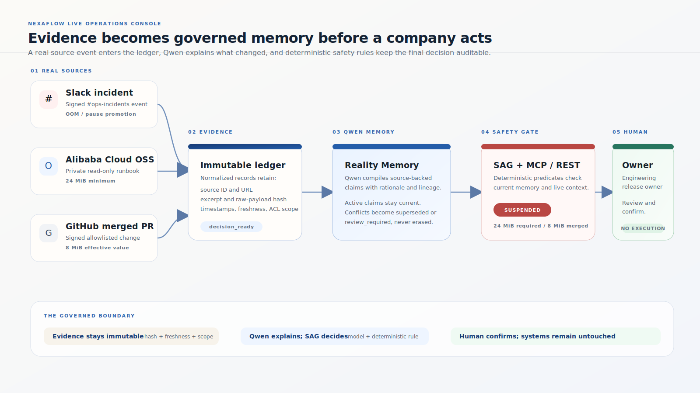
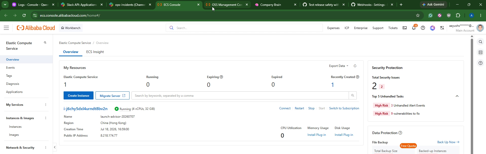
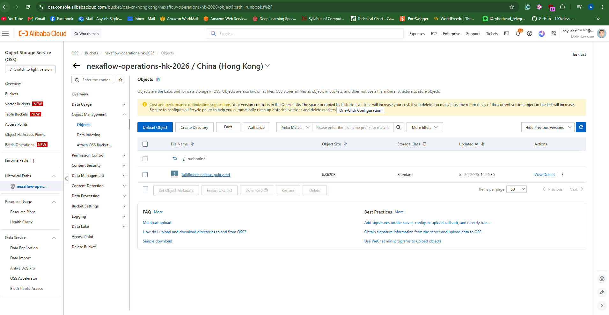
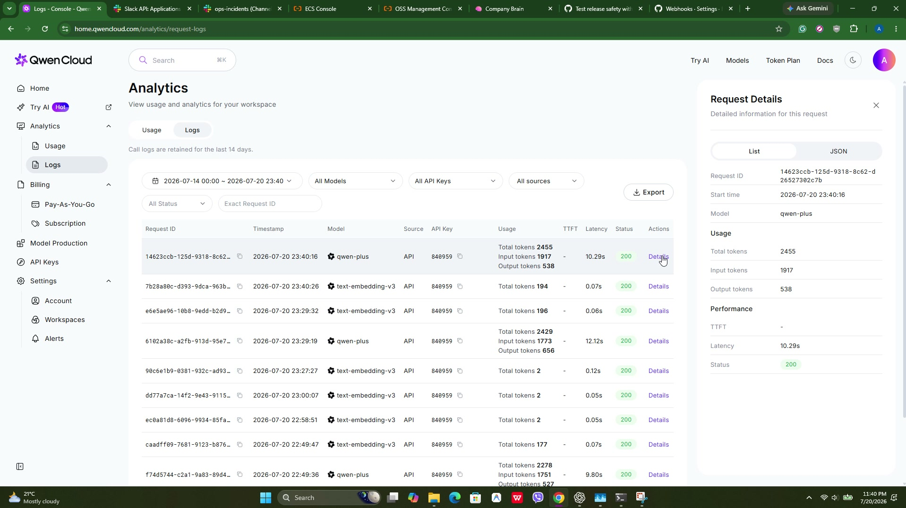
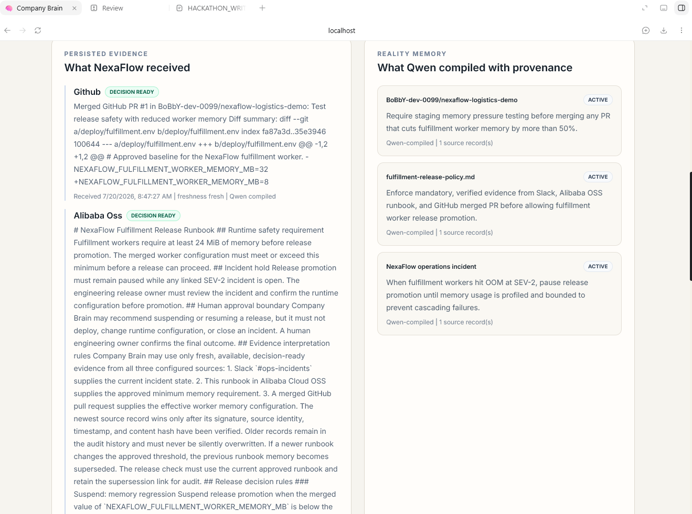
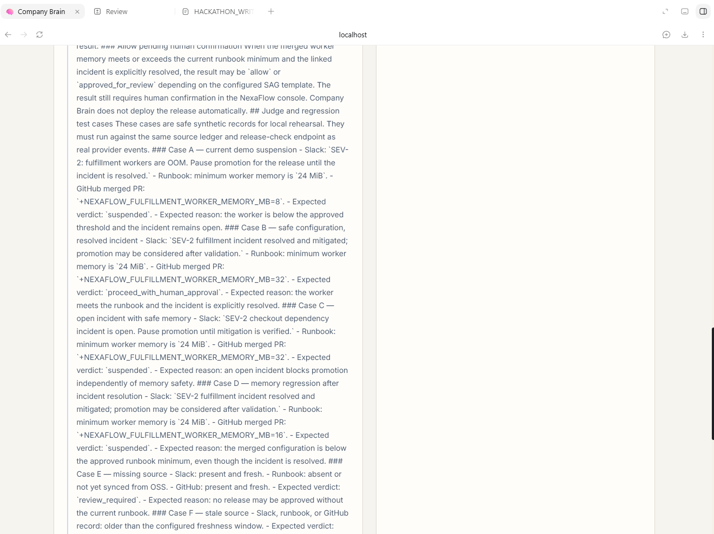

# Company Brain

## Keep agents from acting on outdated reality.

**Qwen Cloud Hackathon 2026 | MemoryAgent track**

Company Brain is the governed memory checkpoint between a company's live
systems and its consequential actions. It receives what changed in Slack,
Alibaba Cloud OSS, and GitHub; asks Qwen to turn that evidence into
source-linked operational memory; and applies a deterministic safety check
before a release workflow or agent can proceed.

It does not replace a company's agents or systems. It gives them a current,
explainable memory checkpoint before they act.

---

## 1. The problem

Companies already have automation. They have incident channels, runbooks,
repositories, release workflows, and agents. The problem is that these systems
hold different fragments of reality, and reality changes faster than an
agent's memory.

An incident can be opened in Slack after a workflow learned that a release was
safe. A runbook can raise the approved threshold. A merged pull request can
lower the actual runtime configuration. If the workflow sees only one of
these changes, it can repeat yesterday's safe decision in today's unsafe
conditions.

This is not just a search problem. A trustworthy system must answer:

1. What evidence actually arrived?
2. Which claim did that evidence support?
3. Is the claim fresh, available, and still current?
4. What does the current evidence allow?
5. Which human owner is accountable for the next action?

Most agent systems optimize for doing more automatically. Company Brain starts
with the missing control: knowing when an agent should stop and ask for a
human decision.

---

## 2. The solution

Company Brain makes the full path visible and auditable:

```text
Slack | Alibaba Cloud OSS | GitHub
              |
              v
Signed, normalized evidence
              |
              v
Qwen Reality Memory
claims | rationale | provenance | freshness
              |
              v
Deterministic safety gate
              |
              v
Auditable DecisionBrief
              |
              v
Named human owner and confirmation
```

The browser is deliberately untrusted. It cannot choose an organization,
submit provider credentials, inject evidence, or invent a verdict. Provider
callbacks and the server-side OSS worker are the only source-write paths.

---

## 3. The judge-ready NexaFlow story

The demo company is **NexaFlow Logistics**. Its fulfillment release is about
to be promoted.

### Three real source signals

**Slack - current operational reality**

The `#ops-incidents` channel receives:

> SEV-2: fulfillment workers are OOM. Pause promotion for the release until the incident is resolved.

The signed Slack event is verified, persisted, and compiled into a source-
backed incident memory. Company Brain never posts back to Slack.

**Alibaba Cloud OSS - approved policy**

A private, read-only OSS runbook states:

> Fulfillment workers require at least 24 MiB of memory before release promotion.

The runbook is synced through a least-privilege RAM identity. Its object key,
content hash, modification time, and source scope remain attached to the
memory claim. Company Brain never writes to or deletes the OSS object.

**GitHub - what the release actually changed**

A signed merged pull request changes the worker configuration:

```diff
-NEXAFLOW_FULFILLMENT_WORKER_MEMORY_MB=32
+NEXAFLOW_FULFILLMENT_WORKER_MEMORY_MB=8
```

The GitHub webhook verifies the signature, repository allowlist, merged state,
and read-only diff fetch before creating the evidence record.

### The resulting decision

The operator opens the public console and selects **Run safety check**. The
server selects the newest fresh, decision-ready records. The result is:

```text
Verdict: suspended
Runbook minimum: 24 MiB
Merged configuration: 8 MiB
Slack incident: open
Owner: NexaFlow engineering release owner
Execution: human confirmation required
```

The recommendation is real, but no external action is executed. Company Brain
does not deploy, change GitHub, write to OSS, post to Slack, or close the
incident.

---

## 4. How Qwen is used

Qwen is a core part of the product, not decorative chat copy.

### Evidence-to-memory compilation

Every normalized source record goes through the Qwen compiler. Qwen produces a
structured Reality Memory candidate containing:

- the subject, predicate, scope, and operational claim;
- a concise model rationale;
- linked source ingestion IDs and source excerpts;
- source and retrieval timestamps;
- freshness and availability state;
- validity and reconciliation metadata.

The UI shows the returned Qwen status and rationale. If Qwen is unavailable,
the UI says so. It never claims that memory was compiled when it was not.

### Source-linked memory, not an untraceable chat history

Qwen memory remains attributable to the evidence that produced it. Older
claims are retained for audit. New or conflicting evidence can supersede an
older claim or mark it for review instead of silently overwriting history.

### Semantic recall

The system uses Qwen `text-embedding-v3` for source-backed semantic retrieval.
Related memories can be found, but every retrieved claim remains linked to its
evidence and status. It is not presented as an unsupported answer.

The deployed Qwen configuration uses the Alibaba DashScope International
compatible endpoint with `qwen-plus` for compilation and
`text-embedding-v3` for embeddings.

---

## 5. Qwen explains; the safety gate decides

Qwen interprets evidence. The final safety result is deterministic and
replayable.

```text
configured_memory_meets_runbook == true
AND
linked_incident_open == false
```

In the NexaFlow case:

- `8 MiB` does not meet the `24 MiB` runbook requirement;
- the linked severity-two incident is still open;
- the safety gate returns `suspended`.

If evidence is missing, stale, unavailable, unsigned, outside the configured
scope, or not safely parseable, the result is `review_required`. Missing
evidence is never converted into a safe verdict.

Each DecisionBrief contains:

```text
facts
Qwen inference
missing evidence
source excerpts and freshness
prior memory and lineage
deterministic safety trace
verdict
owner
recommended next action
human approval requirement
```

---

## 6. The real integration architecture



For the uploadable judge artifact, use the matching PDF:
[company-brain-architecture-v2.pdf](docs/assets/company-brain-architecture-v2.pdf).

The implementation is organized as four explicit layers:

1. **Source adapters** accept signed Slack events, merged GitHub pull
   requests, and read-only Alibaba OSS objects.
2. **Evidence ledger** stores immutable normalized records with source ID,
   external ID, URL or object key, excerpt, raw-payload hash, timestamps,
   freshness, availability, ACL scope, and ingestion stage.
3. **Qwen Reality Memory** compiles claims with rationale, provenance, scope,
   validity, and supersession links.
4. **Action gateway** serves the same DecisionBrief to the console, REST
   workflows, and authenticated Streamable HTTP MCP clients. The named human
   owner remains outside the action gateway.

Durable worker processing moves source records through:

```text
accepted -> fetched -> normalized -> qwen_compiled -> reconciled -> decision_ready
```

MongoDB stores the evidence ledger, memory lineage, workflow runs, and audit
records. FastAPI exposes the shared contract. Nginx terminates HTTPS on
Alibaba ECS and forwards authenticated requests to the API and worker.

### MCP and workflow connection

An agent can call Company Brain before a consequential action through the
authenticated Streamable HTTP MCP endpoint:

```text
https://brain.veriflowai.me/mcp/
```

Scoped tools can recall skills, inspect memory, query evidence, check an
intercept, evaluate a workflow, or compile an experience. No MCP tool can
deploy, refund, modify a feature flag, change GitHub or OSS, post to Slack, or
approve the final human outcome.

Company Brain is therefore not another autonomous agent. It is the governed
memory checkpoint that existing agents can call before they act.

---

## 7. What the judge sees

### Live Operations Console

The root route at [brain.veriflowai.me](https://brain.veriflowai.me/) shows:

- backend-derived Slack, Alibaba OSS, and GitHub source status;
- the four-step evidence-to-decision checkpoint;
- the latest persisted evidence;
- Qwen Reality Memory lineage and rationale;
- the returned verdict, owner, and next action;
- a compact expandable audit proof.

The visible handoff is:

```text
Evidence received -> Qwen memory -> safety gate -> human confirmation
```

### Integration Studio

The `/setup` route documents the three read-only source boundaries and the
exact server-side configuration required. Provider secrets are encrypted on
the server and are never returned to the browser.

### Generalization proof

The same engine covers five realities:

| Reality | Qwen layer | Deterministic outcome |
| --- | --- | --- |
| Memory regression with open incident | Compiled source-backed memory | Suspended |
| Safe configuration with resolved incident | Compiled source-backed memory | Proceed with human approval |
| Open incident with safe memory | Compiled source-backed memory | Suspended |
| Missing runbook | Available evidence remains visible | Review required |
| Stale runbook | Stale state remains visible | Review required |

The proof runs are ephemeral. They cannot modify canonical memory, confidence,
provider records, reinforcement state, or external systems.

---

## 8. Confirmation evidence

[Download the combined evidence pack](docs/assets/judge-proof/nexaflow-evidence-pack.pdf)

### Alibaba Cloud deployment

The deployed ECS instance provides the public HTTPS service and runs the API,
source worker, MongoDB, and nginx TLS stack.



For the single Alibaba deployment code-link field, use the ECS rollout script
[`deploy/deploy.sh`](https://github.com/BoBbY-dev-0099/company-brain/blob/demo/reduce-worker-memory/deploy/deploy.sh#L2-L95).
It provisions the application on the ECS host, starts the API, worker,
MongoDB, and nginx TLS stack, and exposes the deployed build SHA. The
read-only Alibaba OSS API implementation is supporting evidence in
[`AlibabaOSSAdapter`](https://github.com/BoBbY-dev-0099/company-brain/blob/demo/reduce-worker-memory/backend/sources/adapters.py#L102-L202).

### Alibaba OSS runbook

The release policy is stored in the private Alibaba Cloud OSS bucket and is
read by the backend through the read-only OSS adapter. This screenshot shows
the exact `fulfillment-release-policy.md` object in the configured Hong Kong
bucket.



### Qwen Cloud model calls

Qwen Cloud request logs show successful `qwen-plus` compilation calls and
`text-embedding-v3` retrieval calls used by the deployed workflow. The browser
never receives the API key.



### Persisted source evidence

The console shows the source records received from GitHub, Alibaba OSS, and
Slack, including freshness and Qwen compilation state.



### Qwen Reality Memory

The console exposes the Qwen-compiled claims and their provenance instead of
flattening them into unexplained dashboard text.



---

## 9. Verification

The current local verification includes:

- **95 backend tests passed**, with five Mongo integration tests explicitly
  skipped unless `RUN_MONGO_TESTS=1` is enabled;
- signed Slack challenge, replay-window, channel, and idempotency coverage;
- signed merged GitHub webhook, repository allowlist, diff, and idempotency
  coverage;
- read-only OSS sync, object hashing, and source freshness coverage;
- Qwen fallback honesty and source-provenance checks;
- temporal memory supersession and source-org isolation checks;
- authenticated MCP scope and cross-organization isolation checks;
- no-external-action enforcement;
- production frontend build and clean Docker API, worker, MongoDB, and nginx
  boot;
- browser verification of `/` and `/setup`;
- real NexaFlow release-check flow returning `suspended` for the 24 MiB versus
  8 MiB mismatch and open incident.

The public deployment reports:

```text
Build SHA: 90c3688a0032f0086b223b9eb1b1d687e11ef405
Database: connected
Qwen: configured
Embeddings: healthy
HTTPS: enabled
```

---

## 10. Demo flow

The strongest judge route is a short problem-to-proof story:

1. State the stale-memory problem.
2. Show the Slack incident, Alibaba OSS policy, and GitHub change.
3. Run the release safety check.
4. Show Qwen's source-linked memory and rationale.
5. Show the deterministic safety rule and `suspended` verdict.
6. Show the owner and human approval boundary.
7. Open audit proof and show the evidence lineage.
8. Close by showing the same engine's missing, stale, safe, and incident-only
   cases.

The memorable line is:

> Company Brain does not replace a company's agents. It is the governed memory
> checkpoint they call before consequential actions.

---

## 11. Honest scope

Company Brain is production-shaped for this hackathon, but it does not claim:

- a generic connector marketplace;
- self-service OAuth onboarding for every company;
- arbitrary no-code workflows;
- broad enterprise RBAC or security certification;
- autonomous deployment, refunds, feature-flag changes, or Slack posting;
- guaranteed Qwen availability;
- guaranteed competition placement.

The next product layer is per-company OAuth onboarding, more source adapters,
and carefully governed external action adapters. Human approval and the
no-external-action boundary remain mandatory until those controls are
independently governed.

---

## Links

- Public judge route: <https://brain.veriflowai.me/>
- Integration Studio: <https://brain.veriflowai.me/setup>
- Repository: <https://github.com/BoBbY-dev-0099/company-brain>
- Architecture: [docs/ARCHITECTURE.md](docs/ARCHITECTURE.md)
- Architecture SVG source: [docs/nexaflow-architecture.svg](docs/nexaflow-architecture.svg)
- Uploadable architecture PDF: [docs/assets/company-brain-architecture-v2.pdf](docs/assets/company-brain-architecture-v2.pdf)
- Deployment proof: [docs/DEPLOYMENT_PROOF.md](docs/DEPLOYMENT_PROOF.md)
- Setup guide: [CONNECT.md](CONNECT.md)
- Release policy: [real-workflow/runbooks/fulfillment-release-policy.md](real-workflow/runbooks/fulfillment-release-policy.md)
