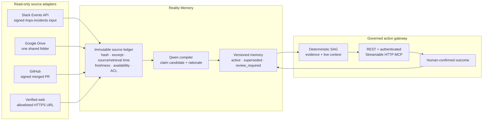

# Architecture

Company Brain is a source-backed operational memory system. Its governance layer is the final checkpoint, not the whole product.

## Ingestion lifecycle

Every source event is idempotent by `(org_id, provider, external_id)` and moves through:

`accepted → fetched → normalized → qwen_compiled → reconciled → decision_ready`

Failures retain an error and stage rather than silently disappearing. The worker service reads durable pending work; Slack returns after evidence is persisted, not after the model step. A source record contains its external ID, URL where available, raw-payload SHA-256, redacted raw metadata, excerpt, source timestamp, retrieval time, freshness, availability, ACL scope, and ingestion state.

### Adapter boundaries

| Adapter | Acceptance rule | No-action rule |
| --- | --- | --- |
| Slack | HMAC signature, five-minute timestamp window, configured team, configured channel, ordinary message only. | Does not post, reply, or read outside the configured channel. |
| Google Drive | Read-only service account, exactly one shared folder, MIME allowlist, modified time/content hash tracking. | Does not write, change sharing, or use domain-wide delegation. |
| GitHub | Existing signed webhook + explicit repository allowlist for merged PRs. | Does not merge, comment, or modify a repository. |
| Verified Web | API-key authentication, exact host allowlist, HTTPS, safe redirect, public-IP resolution, MIME/size/time controls. | Does not search the web or act as an arbitrary outbound proxy. |

## Reality Memory

The source pipeline converts a Qwen compilation into a `RealityMemory` record. It has a claim key, subject/predicate/scope, Qwen rationale, source ingestion and evidence IDs, validity window, and a deterministic state. A conflicting newer claim never overwrites a prior one: the old record becomes `superseded` and points at the replacement; uncertain cases can be `review_required`.

SAG reads only current memory and fresh live context. A source can enrich the audit trail but cannot invoke an external tool or make an action authoritative.

## Decision contract

`WorkflowTemplate`s remain server-owned and versioned. They define evidence requirements, live-context schema, deterministic SAG predicates, memory type, owner role, recommended action, fixtures, and evaluation cases. A run returns a shared `DecisionBrief`:

`facts · inference · missing_evidence · excerpts/freshness · prior memory · SAG trace · verdict · owner · recommended action`

The three proof templates are Release Safety, Money Safety, and Rollout Safety. They use one engine; no no-code workflow builder is claimed.

## MCP trust boundary

The remote endpoint is Streamable HTTP at `/mcp/`. Every request carries `X-Brain-Api-Key`; server-side authentication resolves the organization and scopes the tools. The caller cannot override `org_id`.

| Permission | Tools |
| --- | --- |
| `mcp:read` | `recall_skills`, `inspect_memory`, `query_evidence` |
| `mcp:check` | `check_intercept` |
| `mcp:workflow` | `evaluate_workflow` |
| `mcp:write` | `compile_experience` plus controlled source-sync routes |

There is intentionally no MCP tool for deploy, refund, feature-flag, or Slack execution. Human outcome recording stays in REST/UI.

## Storage and isolation

MongoDB stores organization-scoped skills, events, workflow runs, source ingestions, source connections, Reality Memory, outcomes, API-key metadata, audit records, and temporary judge sandboxes. Browser sessions map to opaque, signed, expiring judge organizations. Sandbox evidence and memory use Mongo TTL and cannot reinforce skills, enable `auto_execute`, alter canonical fixtures, or cross session boundaries.

## Deployment shape

Docker Compose runs MongoDB, the FastAPI API, nginx, and a separate source worker. nginx terminates TLS in the Alibaba ECS deployment and forwards the MCP API-key header. `GET /demo/readiness` reports the deploy build SHA and Qwen health; `/mcp/attestation` reports TDX only when the running host verifies it, otherwise it reports the RSA audit fallback.
