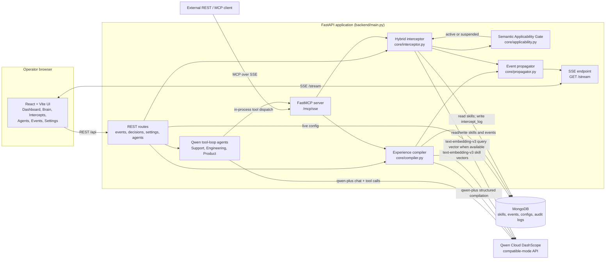

# Company Brain architecture

## System summary

Company Brain is a persistent operating-memory and governance layer for AI agents. Resolved experiences enter as raw events and are compiled by Qwen into versioned, scoped skills; agents and external MCP clients can recall those skills or run a pre-flight decision check before acting. The interceptor combines keyword and embedding relevance with the deterministic Semantic Applicability Gate (SAG), which evaluates each matched skill's live preconditions against organization metadata. The React UI presents the stored brain and its audit trail, changes live configuration through FastAPI, and receives state changes through SSE. MongoDB stores the organizational memory and configuration; Qwen Cloud DashScope supplies generation and embeddings.

## Main system diagram



Rendered PNG:  · Mermaid source: [ARCHITECTURE.mmd](ARCHITECTURE.mmd)

```powershell
npm exec --yes --package=@mermaid-js/mermaid-cli -- mmdc -i docs/ARCHITECTURE.mmd -o docs/architecture.png
```

## SAG live-config sequence: 8MB versus 25MB

The following is the seeded `data-export-large-file-timeout` demonstration skill. Its preconditions are `applies_if export_chunk_size_mb > 10` and `invalidated_if export_chunk_size_mb <= 10`; its seeded confidence is 0.94 and `auto_execute` is enabled. The decision is the same in both cases. The metadata changes the result.

```mermaid
sequenceDiagram
    actor Operator
    participant UI as React Brain / Settings UI
    participant API as FastAPI
    participant Store as MongoDB org_configs + skills
    participant INT as Interceptor
    participant SAG as Deterministic SAG
    participant SSE as SSE propagator

    Operator->>UI: Change export chunk size
    UI->>API: POST /settings/live-config
    API->>Store: Merge metadata and update updated_at
    API->>SSE: Emit config_updated
    API->>INT: Same engineering decision + live metadata
    INT->>Store: Load active skill and persist audit result
    INT->>SAG: Evaluate applies_if / invalidated_if

    alt export_chunk_size_mb = 8
        SAG-->>INT: suspended: invalidated_if <= 10 matches
        INT->>Store: Set applicability_status=suspended; log intercept
        INT->>SSE: Emit skill_suspended / decision_intercepted
        INT-->>API: result=suspended; no reinforcement or auto-execution
        API-->>UI: sag.result=suspended
    else export_chunk_size_mb = 25
        SAG-->>INT: active: applies_if > 10 holds
        INT->>Store: Reinforce eligible skill; log intercept
        INT->>SSE: Emit decision_intercepted
        INT-->>API: result=auto_execute for this seeded skill
        API-->>UI: sag.result=auto_execute
    end
```

SAG is not an additional LLM decision: after the relevance gate picks the appropriate skill, `backend/core/applicability.py` evaluates typed conditions locally. If an embedding request is unavailable, relevance degrades to keyword-only scoring; the SAG check remains deterministic.

## Components

| Area | Repository paths | Responsibility |
|---|---|---|
| Frontend pages | `frontend/src/pages/{Dashboard,Brain,Intercepts,Agents,Events,Settings,ApiKeys,Landing,Onboard}.tsx` | Operator UI for the brain, live SAG configuration, audit history, agent runs, events, metrics, and API keys. |
| API and stream | `backend/main.py` | FastAPI lifespan, REST endpoints, `GET /stream`, `/settings/live-config`, agent routes, and the mounted MCP server. |
| Interceptor | `backend/core/interceptor.py` | Selects relevant skills with keyword plus optional cosine similarity, applies result thresholds, persists audit records, and broadcasts updates. |
| Applicability | `backend/core/applicability.py` | Deterministically evaluates `applies_if` and `invalidated_if` against request/live metadata; can suspend stale skills. |
| Compiler | `backend/core/compiler.py` | Converts a raw event into a typed skill with structured Qwen output and creates its embedding. |
| MCP | `backend/mcp/{server,tools}.py` | Exposes `recall_skills`, `check_intercept`, and `compile_experience` over FastMCP/SSE; the same tools are called in-process by demo agents. |
| Agents | `backend/agents/` | Shared Qwen function-calling loop plus Support, Engineering, and Product agent specializations. |
| Memory store and propagation | `backend/brain/store.py`, `backend/core/propagator.py` | MongoDB persistence/indexes, org-scoped reads/writes, intercept audit logging, and operator event fan-out. |
| Integration examples | `integrations/` | Reference REST/client integrations and example source-system adapters for GitHub PRs, Zendesk, billing/refunds, feature flags, and product sessions. |
| Local deployment shape | `Dockerfile`, `Dockerfile.frontend`, `docker-compose.yml`, `deploy/nginx.docker.conf` | Containerized API, frontend/nginx, and MongoDB. The compose file labels this as an **ECS mimic**, not proof of a deployed ECS instance. |

## Data model

MongoDB is the durable, organization-scoped memory store (`backend/brain/store.py`). The principal documents are:

| Collection | Key fields relevant to judging | Purpose |
|---|---|---|
| `skills` | `skill_id`, `org_id`, `version`, `pattern`, `knowledge`, `executable`, `provenance`, `embedding`, `is_active` | Persistent, versioned experience. `provenance.applies_if` and `provenance.invalidated_if` are arrays of `{key, operator, value}` conditions. Provenance also records confidence, reinforcement, decay, status, last check, and suspension reason. |
| `events` | `event_id`, `agent_id`, `content`, `outcome`, `metadata`, `org_id`, `session_id`, `occurred_at` | Raw cross-session experiences that may be compiled into skills. |
| `intercept_log` | `agent_id`, `decision_text`, `matched_skill`, `result`, `confidence`, `org_id`, `occurred_at`, `applicability_status`, `suspension_reason` | Immutable-style audit trail for blocked, warned, auto-executed, and suspended decisions. |
| `org_configs` | `org_id`, `metadata`, `created_at`, `updated_at` | Current per-organization live metadata, including the demo `export_chunk_size_mb`, consumed by SAG when the UI posts `/settings/live-config`. |
| Supporting collections | `sessions`, `agents`, `api_keys` | Cross-session agent context, registered agents, and organization-scoped credentials. |

The store creates compound unique indexes for `skills(skill_id, org_id)`, `events(event_id, org_id)`, `agents(agent_id, org_id)`, and `sessions(session_id, org_id)`, plus skill TTL/indexing and intercept lookup indexes.

## Qwen Cloud usage map

| Model | Where it is used | Implementation evidence |
|---|---|---|
| `qwen-plus` | Structured event-to-skill compilation and the Support, Engineering, and Product agents' DashScope-compatible chat/function-calling loop. | `backend/core/compiler.py`, `backend/agents/base.py`, `backend/config.py` (`QWEN_COMPILER_MODEL`, `QWEN_AGENT_MODEL`). |
| `text-embedding-v3` | 1024-dimensional skill embeddings at compilation/backfill time and query embeddings for semantic recall/interception when vectors are available. | `backend/core/compiler.py`, `backend/core/interceptor.py`, `backend/config.py` (`QWEN_EMBEDDING_MODEL`, `EMBEDDING_DIMENSIONS`). |

Both calls use the configured DashScope international compatible-mode base URL. Qwen is used for compilation, embeddings, and agent behavior; SAG's applicability verdict is intentionally local and deterministic rather than generated by a second model call.

## TEE boundary: honest status

`GET /mcp/attestation` returns a **mock attestation envelope**: it supplies a demonstrative Intel TDX/Alibaba Cloud-shaped payload, a deterministic mock measurement, and the MCP tool manifest. It is useful for showing where a trust boundary and tool measurement would be surfaced, but it is **not** evidence that the running demo is in a TDX enclave and must not be presented as verified production TDX. A production implementation would run on a TDX-capable Alibaba Cloud instance, obtain a hardware-backed attestation for the executing enclave, and bind that measurement to the service's signing/identity workflow.
